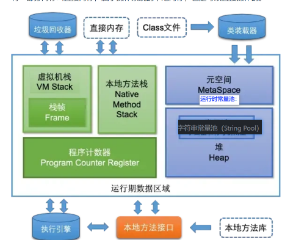
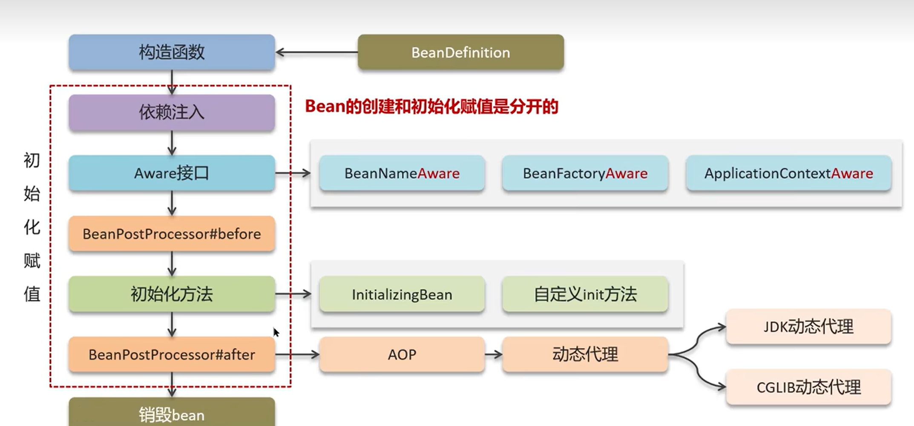
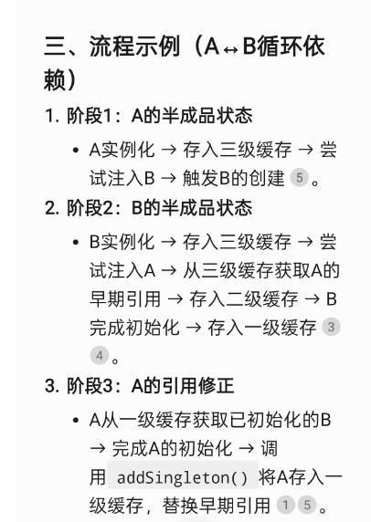
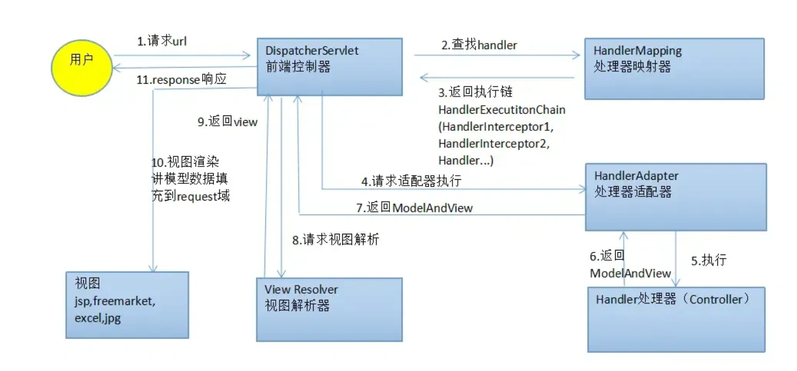
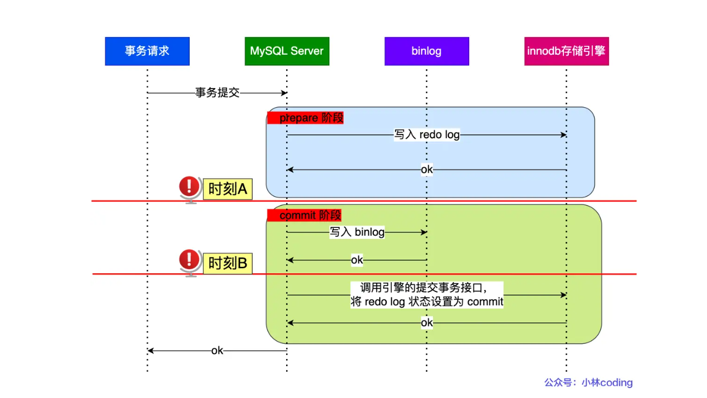
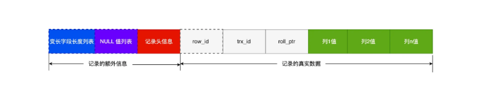

## 1.并发
1. 死锁产生的四个条件:
- 互斥条件,线程之间资源不可共享必须独占
- 持有并保持条件,线程持有资源并等待其他资源
- 不可被剥夺条件,现成所持有的资源不能被剥夺
- 循环等待条件,线程之间形成环形等待资源的关系
- 避免死锁的策略:
  - 按照相同的资源的顺序申请资源
2. 线程安全的三个方面:
- 原子性 :synchronized关键字,Lock锁
- 进程可见性 :volatile关键字,sychronized关键,Lock锁
- 有序性 :volatile关键字
3. wait 和 sleep的区别:
- 语法上:sleep是thread类的静态方法,wait是object类的实例方法,wait配合synchronized使用,thread.sleep不需要
- 锁上: wait会释放锁,使其他线程可以获取锁,而sleep不会释放锁,wait主要为了配合业务上锁之间的配合竞争关系,sleep主要是为了让线程休眠
- 唤醒上: wait需要notify或notifyAll唤醒,而sleep只需要时间到期就会自动唤醒,wait也可以加时间参数
  

4. 线程池的核心参数:
- corePoolSize: 核心线程数,即使没有任务也会存活
- maximumPoolSize: 最大线程数,超过核心线程数的线程会被回收  
- keepAliveTime: 非核心线程的存活时间,超过这个时间会被回收
- workQueue: 任务队列,存放等待执行的任务
- threadFactory: 线程工厂,用于创建线程
- handler: 拒绝策略,当线程池满了,无法处理新任务时的处理方式
5. 核心线程数的设置:
- io密集型任务: 核心线程数设置为cpu核心数的2倍(执行io密集任务时,线程大多数时间在等待网络连接,cpu处于空闲状态,而cpu核心数的2倍可以充分利用cpu资源)
- cpu密集型任务: 核心线程数设置为cpu核心数-1(留出一个用来处理阻塞状态)
- 线程的上下文切换:指的是cpu在多个线程之间切换,但需要保存当前线程的状态,然后加载下一个线程的状态,这个过程会消耗cpu资源,因此线程数过多会导致频繁的上下文切换,从而降低性能
6. threadlocal的原理:
- threadlocal用于存储线程专有变量,但准确地来说是有ThreadLocalMap来存储value,每个线程都有一个独立的 ThreadLocalMap（存储在 Thread 类的成员变量中），用于存储线程私有的变量,由entry数组组成,其中key为threadlocal对象,value为对应的值,通过threadlocal的set和get方法来操作entry数组中的value,虽然key为弱引用但是value为强引用,key会被回收,但是value不会被回收,从而导致内存泄漏,需要手动调用remove方法来清除.

1. ReentrantLock是怎么实现公平锁的？
- reentrylock通过在cas前做一个判断队列是否为空的操作,如果队列不为空,则执行上锁失败的逻辑,将自身加入到队列中.

1. completableFuture: 
- 完全版的Future,future的get方法是阻塞的,而completableFuture可以通过thenAccept,thenRun等方法来处理异步结果. 
- 内置异常处理,exceptionally方法可以处理异常,而future的get方法会抛出异常.需要手动处理异常
1. synchronized锁升级:
- 无锁状态:线程获取锁时,如果锁没有被其他线程持有,则直接获取锁,进入无锁状态
- 偏向锁状态:线程获取锁时,如果锁没有被其他线程持
- 轻量锁:lock_record和mark_word进行cas操作,如果成功则进入轻量锁状态,锁重入不进行cas
- 重量级锁
1.  拒绝策略:
- abortpolicy: 抛出异常,默认策略
- callerrunspolicy: 由调用者线程执行任务
- discardpolicy: 丢弃任务
- discardoldestpolicy: 丢弃队列中最旧的任务

## 2. 常见集合
1. arraylist:
- arraylist初始化时容量为0，第一次添加元素时扩容到10，之后每次扩容为原容量的1.5倍,每次扩容都会拷贝数组
2. hashmap:hashmap的底层结构是数组+链表+红黑树,当我们进行添加元素时,首先对我们的key进行hash运算并获得数组中的索引位置,如果该位置没有元素,则直接插入,如果该处有元素,那么首先判断key是否相同,如果相同则覆盖value,如果不相同,我么要插入的元素作为该元素后缀节点,如果链表长度超过8,则将链表转换为红黑树.
3. hash碰撞时,判断对应链表中是否存在要插入的key,判断方法是使用两个指标,一个是hashcode,另一个是equals方法,(会进行一个从头到尾的遍历判断)hashcode相等,equals为true,才能判断链表中原先就存在key否则的话说明没有,需要新插入.
4. hashmap 扩容每次扩容2倍,保证capacity始终为2的幂次方,二进制角度上只有一位为1,
将capacity-1与hash值进行运算的效率远大于hash值与capacity进行取模运算
5. 当链表长度大于8且数组长度大于64时,会将链表转换为红黑树,通过这种方式可以提高查询效率,如果数组长度不大于64,则进行hash扩容,通过rehash来提高查询效率(当数组长度大于64时,进行扩容然后rehash的成本太高)
1. HashSet 的底层实现确实是基于 HashMap 的。HashSet 只存储元素的值，而不存储键值对。它的每个元素作为 HashMap 的键，值则是一个固定的对象（名为present的object常量）。


## 3.基础
1. java中为什么要有integer:
- 泛型,泛型只能使用引用类型
- 类型转换,类型转换时需要使用引用类型
- 集合,集合中只能存储引用类型
2. 基本数据类型:long,short ,int,byte,double,float,char,boolean
3. integer内部有一个缓存池,用于存储不同int值对应的integer引用对象,当使用interger.valueOf方法时,如果值在-128到127之间,则直接返回缓存池中的对象,否则创建新的对象,可以通过设置jvm参数-XX:AutoBoxCacheMax=1000来改变缓存池的范围
4. 反射:反射就是对于任何一个类都能够知道他的方法和属性,任何一个对象都可以调用它的任何一个方法和属性,这种动态获取类的信息和动态调用对象的方法就叫做反射 
   - 反射的特性:
     - 可以在运行时获取类的信息
     - 可以在运行时动态创建对象
     - 可以在运行时动态调用方法
     - 可以在运行时修改属性值
5. 封装:封装就是将对象的属性和方法**封装**在类中;
6. 继承:继承就是一个类可以**继承**另一个类的属性和方法.  
7. 多态:多态就是同一个方法在不同的对象上表现出**多**种表现形**态**.
8. 接口和抽象类的区别:接口的存在意义是为了定制一组行为规范,而抽象类的意义是共享代码和部分实现.接口支持多继承,抽象类只支持单继承.是因为抽象类如果多继承会产生同名方法或属性无法确定用哪个的冲突
9.  接口和抽象类都不能被实例化
10. final是最终的意思,断子绝孙, final修饰类表示不可被继承,修饰方法表示不可被重写,修饰变量表示不可被修改
11. 在我看来,对类的继承和对类内部的函数重写在java各种语法上来说,属于同一个维度的操作
12. 浅拷贝就是创建一个新对象，将原对象的基本类型属性值复制过去；(如果属性是引用类型，则只是复制引用，两个对象内部指向同一个引用对象,引用属性实际上就是地址)
13. 深拷贝就是创建一个新对象，将原对象的基本类型属性值复制过去；(如果属性是引用类型，则会创建一个新的引用对象，并将原对象的引用对象的值复制过去，两个对象内部指向不同的引用对象)
14. properties.load(in) 方法会将 XML 或 properties 文件中的内容加载到 Properties 对象中，文件中的 key=value 会自动形成一个键值对映射，底层就是一个 Map 结构。你可以通过 properties.getProperty(key) 获取对应的 value.
15. lambda 本质上就是匿名内部类的简化写法，让代码更简洁。
16. hashcode,equal: 重写hashcode必须重写equal,两个对象如果hashcode相等,equal不一定为true,但是如果equal为true,则hashcode一定相等,底层就是,假如在一个hashmap中进行非空桶插入,应该先判断key的hashcode是否相等(不相等的话直接判断为hash冲突),如果相等再判断equal是否相等,如果equal相等则覆盖value,如果不相等(也是hash冲突).

## 4. JVM
1. 静态对象（static变量）是类级别的信息，因为它属于类本身，而不是某个具体对象。只要类被加载，静态变量就会分配内存，所有该类的对象共享同一个静态变量。它不依赖于对象的创建和销毁，生命周期和类一致，所以称为类级别的信息。
2. 类中的方法属于类级别的信息，同样存储在元空间,元空间内存储的是类接别的信息
3. static 变量（包括静态对象、基本类型、集合等）都归属于定义它的类本身，是类级别的信息。只要类被加载，static 变量就会分配内存，所有该类的对象共享同一个 static 变量。它不依赖于对象的创建和销毁，生命周期和类一致。{言简意赅的话,就是属于上一级}
4. 
5. jvm中的pc(并非和cpu的pc寄存器一样),每个线程都有自己的pc,用于记录自己的终止位置,在上下文切换时时通过读取pc值来恢复线程的执行位置.
6. string and 常量池
- string s= "abc"如果常量池有的话就不生产对象,没有的话就生成新object在常量池中
- string s= new String("abc")会在堆中创建一个或两个新的对象,一个在堆中,一个在常量池中,如果常量池中已经有了"abc",则不会再创建新的对象,而是直接使用常量池中的对象;
7. 内存泄漏和溢出
 - 内存泄漏:指不再使用的对象仍然被引用,导致垃圾回收器无法回收这些对象,大量堆积,从而导致内存泄漏
 - 内存中内存满溢,无法继续分配内存,常见分为堆溢出(对象过多),栈溢出(递归过深)
8. 创建对象的过程:

- 1. 类加载检查,根据符号引用去常量池检查常量池中是否有对应的类信息,如果有则直接使用,如果没有则加载类信息到方法区
- 2. 分配内存
- 3. 初始化零值:分配到的内存空间全部初始化为0
- 4. 设置对象头:比如对象的哈希码、来自那个类,如何才能找到类的元数据信息
- 5. 执行构造方法,执行父类的构造方法,直到Object类的构造方法执行完毕
1. 类的加载:
- 1. 通过方法区的类名找到,找到对应的class二进制文件,将其加载成动态的数据结构(其中包括将符号引用加载到常量池中),并在内存中生成一个class对象
- 2. 连接(class文件和jvm的连接):
  - 验证:验证类的字节码是否符合规范,是否有安全问题
  - 准备(为类的正常运行提前准备):为类的静态变量分配内存并设置默认值
  - 解析:将符号引用(符号引用是指向常量池中类信息的索引，而常量池中的类信息存储的是类的全限定名（包名+类名）。所以，你可以认为符号引用是一种间接表示类的全限定名的方式)转换为直接引用
- 3. 初始化:执行类的静态代码块,初始化静态变量,执行父类的静态代码块,直到Object类的静态代码块执行完毕
- 4. 卸载:当类不再被使用时,可以被卸载,释放内存
- **每个类是否有常量池？
是的，每个类都有自己的常量池（Constant Pool）。

位置和来源：常量池是 .class 文件的一部分，当类被加载到 JVM 时，它被存储在方法区（JDK 8+ 为元空间）中。每个类文件都有独立的常量池，不与其他类共享。
内容：包含符号引用（类名、方法名、字段名等间接引用）、字面量（字符串、数字常量）和类型信息，用于运行时解析为直接引用（内存地址）。
作用：支持动态链接、方法调用和字段访问。例如，在类加载的加载阶段，符号引用被加载到常量池；在解析阶段，转换为直接引用。
**

## 5. spring 
1. springboot的自动配置原理,@springbootApplication中有一个@EnableAutoConfiguration注解,@enableAutoConfiguration中有一个@Import(AutoConfigurationImportSelector.class)注解,这个注解会导入AutoConfigurationImportSelector类,AutoConfigurationImportSelector 通过扫描 META-INF/spring.factories 文件（位于各个 starter 的 JAR 包中）来加载所有候选的自动配置类列表,然后，对于每个候选配置类，使用 @Conditional 系列注解（如 @ConditionalOnClass、@ConditionalOnProperty 等）来判断是否满足条件，从而决定是否加载该自动配置类。
然后，对于每个候选配置类，使用 @Conditional 系列注解（如 @ConditionalOnClass、@ConditionalOnProperty 等）来判断是否满足条件，从而决定是否加载该自动配置类
2. bean的生命周期
3. spring中的bean默认是单例的,也就是说在运行中只会创建一个实例,存在spring容器中,多次进行复用;将scope改为prototype是每次获取bean都会创建一个新的实例,存在于spring容器中,每次获取都会创建一个新的实例
4. spring常用注解:
- @Autowired: 自动注入,可以通过类型或名称进行注入
- @Component: 将类标记为一个spring组件,可以被spring容器管理
- @Service: 标记为一个服务层组件,通常用于业务逻辑处理
- @Controller: 标记为一个控制器组件,通常用于处理web请求
- @Repository: 标记为一个数据访问层组件,通常用于数据访问操作
- @Configuration: 标记为一个配置类,用于定义bean的创建和配置
- @Bean: 用于在配置类中定义一个bean
5. spring循环依赖:

空壳实例和最终实例的根本地址相同,只不过处于不同的生命周期
6. 为什么需要三级缓存:
为了处理动态代理对象的问题,动态代理就像给原始对象套上一个“外壳”，这个“外壳”是一个新的对象，用来增强原始对象的功能。虽然“外壳”内部包含原始对象，但它本身是独立的，所以地址不同。三层缓存中的getObject方法提前预判,会返回这个“外壳”对象，而不是原始对象。这样可以确保在循环依赖的情况下，能够正确地返回代理对象，而不是原始对象，从而避免了循环依赖的问题。
7. spring设计模式:
- 单例模式: spring中的bean默认是单例的,即每个bean在spring容器中只有一个实例
- 工厂模式: spring中的bean是通过工厂方法创建的,即通过@Bean  注解或@Configuration注解来定义bean的创建方法
- 代理模式: spring中的AOP就是通过代理模式实现的,即通过动态代理来增强对象的功能
- 模板设计模式: spring中的JdbcTemplate,RestTemplate等都是通过模板设计模式来简化操作的,即提供一个模板方法来执行一系列操作
8. 单例bean和非单例bean的区别生命周期上的区别:
- 创建:单例bean在spring容器**启动**时就会被创建,并且在整个应用程序的生命周期内只会存在一个实例,非单例bean在每次获取时都会创建一个新的实例
- 初始化:方法基本相同
- 销毁:销毁方法不同,单例bean在spring容器**关闭时会调用销毁方法**,非单例bean**手动处理**
### 5.2springMVC
1. m(model)是用来传递数据的,v(view)是用来渲染页面的,c(controller)是用来处理请求的.
2. 具体流程

### 5.3springboot
1. springboot的自动配置原理,@springbootApplication中有一个@EnableAutoConfiguration注解,@enableAutoConfiguration中有一个@Import(AutoConfigurationImportSelector.class)注解,这个注解会导入AutoConfigurationImportSelector类,这个类会加载所有的自动配置类,然后通过spring.factories文件来加载自动配置类,最后通过@Conditional注解来判断是否需要加载该自动配置类
2. springboot相对于spring的优势:(starter,服务器,自动配置)
- 简化配置: springboot通过约定大于配置的方式,减少了大量的配置文件和代码,使得开发更加简单
- 内嵌服务器: springboot内置了Tomcat,Jetty等服务器
- 自动配置: springboot通过自动配置的方式,根据项目的依赖和配置自动加载所需的组件,减少了手动配置的工作量
- 快速开发: springboot提供了大量的starter依赖,可以快速集成各种功能,如数据库连接,缓存,消息队列等
springboot有各种开箱即用的组件,提供了starter依赖,还有自动配置,以及内嵌服务器
## mybatis
1. #{}和${}的区别:
  - #{}时将#{}部分的内容转换成?先进行预编译,然后将参数传入,防止sql注入
  - ${}时将${}部分的内容直接进行sql拼接,不进行预编译,容易导致sql注入
2. mybatis优点:
- 代码量少
- 支持动态标签
- 映射完全
3. MybatisPlus和Mybatis的区别？

- MybatisPlus提供了内置的CRUD操作,可以减少大量的代码编写
- MybatisPlus提供了内置的分页插件,可以方便地进行分页查询
- MybatisPlus提供了内置的代码生成器,可以快速生成实体类,Mapper接口,Mapper XML文件等
## springcloud
1. 微服务雪崩:服务a调用服务b,由于服务b的服务不可用,导致服务a超时重传,线程资源无法释放最终堆积大量请求,导致线程资源耗尽,服务a也崩溃,整条调用链上的节点线程资源都被耗尽,最终都无法使用,这种滚雪球最终导致网络雪崩的现象就叫做雪崩
2. 微服务熔断(用于处理雪崩问题):微服务熔断就像保险丝熔断,哪里电压高哪里就熔断,我们微服务哪里网络压力高就熔断哪里,当我们微服务调用的失败阈值超过一定值时,就会触发熔断,不再进行调用,而是直接返回错误信息,避免网络雪崩
3. 微服务降级:当某个微服务调用失败时,会进行降级处理,返回一个默认值,避免服务雪崩
4. at(提交后若失败一起回滚),xa(等待一起提交),tcc(提前预留资源,若成功则提交,若失败则删除冻结资源)

## mysql
1. 执行流程
- 建立连接
- 查询缓存(8.0以后废弃)
- 句式分析(词法分析,语法分析,构建语法树)
- 预处理(检查字段是否存在,将* 替换为具体字段)
- 优化器(查询重写,选择最优的执行计划)
- 执行计划(将执行计划转换为具体的执行步骤)
2. 索引:帮助mysql高效获取数据的数据结构叫做索引
3. 索引分类:
- 物理结构上:聚簇索引和非聚簇索引
- 逻辑结构上: 主键索引,普通索引,联合索引,唯一索引
4. 为什么使用雪花算法:
- 自增主键会使用锁,降低生成性能,雪花算法全局唯一,不会用锁
- 业务保密性:自增主键可以被猜测到,雪花算法生成的id不可预测.
  
5. 索引失效:
- 对索引列表达式运算
- 索引列使用函数
- 不符合最左前缀
- like左模糊匹配或者左右模糊匹配
6. 日志:
- binlog:二进制日志,记录所有的增删改操作,用于数据恢复和主从复制
- redo log:重做日志,记录事务的修改操作,用于事务的恢复
- undo log:回滚日志,记录事务的回滚操作,用于事务的回滚
- bufferpool是内存层面的缓存,mysql数据存储在磁盘上,对数据进行修改时,会先将修改操作记录到bufferpool中,然后将修改操作记录到redo log中(undolog日志也要记录,需要同步到磁盘的数据都要记录),最后将修改操作写入磁盘
- redolog提交时机: 事务结束时提交,如果在事务中出现错误
- 两阶段提交流程简述
 prepared阶段: 将事务id写入redolog中,将redolg日志写入磁盘,将redolog状态设置为prepared;
 commit阶段: 将事务id写入binlog,binlog日志写入磁盘,将redolog事务状态设置为committed;

 在时刻A发生了系统故障,redolog,进行事务回滚
 时刻B发生了系统故障,则没有大问题,直接提交


 **底层原理**: 系统崩溃后,mysql在磁盘中找到对应的redolog日志,若是prepared状态,则取出对应的事务id,在binlog(同样是磁盘中,同时内存中的已经归零了)中寻找是否有对应的事务id,如果有则提交(说明位于时刻B崩溃),如果没有则回滚(位于时刻A),如果是committed状态,则直接提交
 ### InnoDB Undo Log 与版本链（图示说明）
Undo Log 是 InnoDB 支持事务回滚和 MVCC（快照读）的核心。下面按你之前提供的画法，放一个能直接看懂的图，并用通俗话解释每一部分。

````text
数据页（当前行）
+---------------------------------------------------------------+
| id=30 | age=10 | name=A3 | DB_TRX_ID=4 | DB_ROLL_PTR=0x0003  |
+---------------------------------------------------------------+
                            │
                            ▼
Undo 链（从新到旧）
+---------------------------------------------------------------+
| U3 (0x0003) : [30 | 3  | A3  | trx=3 ]  prev -> 0x0002
|    (type=UPDATE, payload = 更新前的行值 )
+---------------------------------------------------------------+
                            │
                            ▼
++---------------------------------------------------------------+
| U2 (0x0002) : [30 | 3  | A30 | trx=2 ]  prev -> 0x0001
|    (type=UPDATE, payload = 更新前的行值 )
+---------------------------------------------------------------+
                            │
                            ▼
++---------------------------------------------------------------+
| U1 (0x0001) : [30 |30 |A30 | trx=1 ]  prev -> NULL
|    (type=INSERT, payload = 插入时的行镜像，undo 意味着“删除该行”)
+---------------------------------------------------------------+
````

要点（人话版）：
- 页上那一行是"现在看到的版本"，DB_ROLL_PTR 指向最新的 undo 条目（U3）。
- 每个 undo 条目里有：类型（是 INSERT/UPDATE/DELETE 的回滚记录）和 payload（回滚时需要的旧值或行信息）。
- MVCC 读：如果当前事务看不到页上版本，会顺着 DB_ROLL_PTR 往下找第一个对自己可见的 payload（不修改页，只读历史数据）。
- 事务回滚：会按 undo 链把旧的 payload 反向应用到数据页（UPDATE 写回旧值、DELETE 重新插入、INSERT 则删除）。
- "逻辑操作"并不是可读 SQL，它体现在 undo 条目的 type/flags + payload 里；图上看到的就是这些 payload 和 prev 指针。

（我已按你要的风格画图并且把关键点写得更接地气。如需把这段合并成一行或移动到别的子节，我可以再调整。）

7. 索引下推
- 对于该查询语句SELECT * FROM tuser WHERE name LIKE '张%' AND age = 10;
- 传统情况下,mysql会先通过索引找到所有name以'张'开头的主键id,回表查询后将数据在sever端进行age=10的过滤操作
- 使用索引下推后,mysql会先通过索引找到所有name以'张'开头的主键id,然后在索引层面进行age=10的过滤操作,最后将过滤后的主键id回表查询对应的数据,减少了回表查询的次数,提高了查询效率
 
8. count(*),count(1),count(column)区别:
- count(a)的实际含义就是统计a字段不为null的行数
- count()的底层是这样实现的,server层维护一个count字段,循环从innodb引擎读取每行数据,遇到符合条件的行就将count字段加1,最后返回count字段的值.
- count( * )的底层实际上是count(0),因为0永远不为null,所以count(*)统计的是表的总行数
- 对于count(1),count(*)扫描的是主键索引,innodb在此做了优化,首先扫描二级索引,二级索引数据量更小,扫描更快,io代价更低
9. SELECT * FROM page ORDER BY id LIMIT 6000000,server会先扫描并丢弃前6000000条数据,然后将后10条数据返回,这种方式效率非常低,因为需要扫描大量数据,可以通过以下两种方式优化:
- 游标分页：记住上次 id，如 WHERE id > last_id LIMIT 10。
- select * from page where id >=(select id from page order by id limit 6000000,1)order by id limit 10;;
10. 段->区->页->行
11. 数据行使用compact格式存储

- compact格式分为记录的额外信息和记录的真实数据两部分
- 变长字段列表存储的是varchar等类型的变长字段的实际占用字节数,方便快速定位变长字段大小
- null列表存储的是每个字段是否为null,使用位图的方式存储,节省空间
- 以上两个都是使用倒序存储,方便从后向前读取变长字段和null字段(读取在记录头信息开始)
- 上述的结构都是记录的额外信息
- 记录的真实数据就是广为人知的事务id, row_id,回滚指针,还有实际数据
12. 共享表锁:所谓共享,就是一种允许多个事务同时读取表数据的锁,由于要共享,所以谁都不能修改.
13. 独占表锁:自己独占对表的所有权限,独占表锁是一种只允许一个事务对表数据进行读写操作的锁.
14. 意向锁:意向锁是一种表级锁,用于表示某个事务对某行数据的锁定意图,意向锁只与共享表锁和独占表锁起冲突,当一个事务对某行数据加锁时,会先在表上加一个意向锁,表示该事务对该行数据有锁定意图,然后再对该行数据加锁,这样其他事务在加表锁时,可以通过意向锁来判断是否有事务对该行数据加锁,从而避免不必要的锁冲突.
15. 加 X 锁的是 “当前读”（比如 select ... for update），而其他线程的普通读是 “快照读”（依赖 MVCC），两者互不干扰 ——X 锁阻塞的是其他 “当前读”，不影响 “快照读”，所以看似 “加了锁还能读”，实则是两种读模式的并行机制。
16. InnoDB 负责筛选行，Server 负责选取列和后续处理
17. 索引优化:
- 覆盖索引优化:多建立业务相关的联合索引,保证能一次性命中需要的值,避免回表查询
- 设置为自增主键,自增状态下,叶子节点是连续存储对的,当前页写完之后可以直接写入下一页,而乱序的主键会导致频繁的页分裂,影响写入性能.
- 尽量设置为非null,减少存储空间,常规的compact格式下,会有专门的null序列来存储对应的null信息,非null则不需要存储这些信息,节省空间.
18. 间隙锁之间不会冲突,间隙锁的意义只在于阻止区间被插入，因此是可以共存的。一个事务获取的间隙锁不会阻止另一个事务获取同一个间隙范围的间隙锁，共享（S型）和排他（X型）的间隙锁是没有区别的，他们相互不冲突，且功能相同
19. 在间隙锁锁住区间的同时,如果有事务要插入数据,则会生成一个插入意向锁,阻塞等待间隙锁释放.

 ## redis
1. redis的五种数据类型:
- string:
- hash:
- list:
- set:
- zset:
1. redis zset为什么使用跳表而不是b+树?:
- b+树磁盘友好,跳表内存友好,跳表的结构更符合cpu的局部性原理(指针调整只影响相邻节点,而b+树的指针调整会影响整个树的结构)
- 跳表内存占用较低,只需存储对应的键值,层高,和指针,而b+树需要存储多个键值和指针且会造成内存碎片
- 跳表代码复杂性较低,便于实现和维护
1. redis 的rehash:
- redis中维护两个哈希表来进行rehash扩容,一个是旧哈希表,一个是新哈希表,新哈希表的大小是旧哈希表的两倍,当需要扩容时,采用渐进式rehash,即每次进行增删改查操作的同时,将对应的键值对从旧哈希表迁移到新哈希表中,直到所有键值对都迁移完成,然后将新哈希表替换旧哈希表.
1. string的底层数据结构: sds
- len,alloc(分配给字符串的内存空间),flags,buf
1. redis的多线程表现在处理网络上请求上,而不是处理指令上
2. redis可以通过lua脚本和事务来保证原子性操作,redis事务中如果出现错误,并不会回滚,而是继续执行后续的指令,但是如果在lua脚本中出现错误,则会回滚整个脚本的执行
3. AOF(记录操作指令)三种写回硬盘策略:
- 1. 每次操作都写入硬盘(always)
- 2. 每次写入操作先写入内核缓冲区,每秒钟写入硬盘(everysecond)
- 3. 每次写入操作先写入内核缓冲区,由操作系统决定何时写入硬盘(no)
1. RDB(记录二进制数据快照):
- rdb有两种执行方式:save和bgsave(save会阻塞当前线程,直到数据写入完成,而bgsave会folk一个子进程,不会阻塞当前线程)
1. rdb文件的优缺点
- 优点:文件小,加载速度快,适合大数据量的场景
- 缺点:在生成rdb文件的时候可能出现新的写入操作,而rdb文件同步的只是folk子进程那一瞬间的数据快照,不能保证数据的强一致性
1.  AOF文件的优缺点
- 优点:可以保证数据的强一致性,每次写入操作都会记录到AOF文件中,另外,rdb有多种写回硬盘策略可以选择,可以根据性能调整 
- 缺点:文件大,加载速度慢,因为每次写入操作都会被记录
1.  redis除了缓存以外的应用场景:
- 消息队列:使用redis的list或set数据类型实现消息队列,可以实现生产者消费者模式
- 分布式锁:使用redis的set nx指令
1.  什么是热key:
- 热key是指在一段时间内被频繁访问的key,会导致redis的性能下降,因为热key会导致redis的单线程阻塞,从而影响其他key的访问
- 解决方法:集群架构复制热key到其他节点,避免单个节点的性能瓶颈;如果热key主要用来读取,可以采用读写分离的方法
1.  canal+binlog实现数据同步:
- canal伪装成mysql的一个slave节点,接受binlog日志,将binlog日志解析成结构化事件,发送到消息队列,消费者拿到信息后开始对redis进行处理
1.   布隆过滤器:布隆过滤器道达尔核心结构是一个位图数组和多个哈希函数,将插入的元素进行三次哈希运算,分别将对应的索引位置的值设置为1,查询时同样进行三次哈希运算,如果对应的索引位置的值都是1,则认为该元素存在,否则认为该元素不存在,布隆过滤器的特点是空间效率高,查询速度快,但是会有一定的误判率(由于hash冲突,可能会误判元素存在,但仍然可以大幅度减少查询时间和空间占用).
2.   io多路复用:
- 定义:通过select,poll,epoll等系统调用,在一个线程中同时进行多个io操作.
- select/poll:将已连接的 Socket 都放到一个文件描述符集合，然后调用 select 函数将文件描述符集合拷贝到内核里，内核轮询并由检查事件,将集合中对应的socket状态返回给应用程序,应用程序再根据返回的状态再次进行轮询处理.区别就是select底层使用位图来存储文件描述符集合,而poll使用动态数组来存储文件描述符集合,select支持的文件描述符数量有限(一般为1024),poll没有限制
- epoll:epoll 使用红黑树存储所有监听的文件描述符（socket），当事件发生时，将就绪的 socket 加入双向链表（ready list），然后通过 epoll_wait() 返回给用户处理。优点是高效（O(1) 复杂度），适合高并发场景。
- **epoll_create**：创建内核对象（epoll 实例），内部包含红黑树（存储所有监听 socket）和就绪链表（rdlist，存储发生事件的 socket）。

**epoll_ctl**：将 socket 加入红黑树（增删改操作），内核开始监控这些 socket 的事件。

事件触发：当 socket 有事件（如可读），内核通过回调将其加入就绪链表（无需遍历树）。

**epoll_wait**：阻塞等待，并将就绪链表中的事件复制到用户空间的数组。

边缘触发 (ET)：只复制一次事件，无视是否被处理成功或缓冲区是否还有数据。程序必须一次性处理完（循环读），否则可能丢失后续通知。
水平触发 (LT)：会一直触发（重复返回同一事件），直到缓冲区数据被处理完（读空）。

## 6. 消息队列
1. 消息队列的作用:
- 解耦:调用其他消费者处理信息时即使消费者挂掉了,也不会影响生产者的正常运行
- 异步:生产者发送消息后,不需要等待消费者处理完毕,可以继续执行其他操作
- 削峰:在高并发场景下,可以将请求放入消息队列中,由消费者尽力而为的处理,避免系统过载
2. 生产者丢失(只有收到组件的ack才会认为消息发送成功,否则消息重传),服务端丢失(消息队列宕机,将队列和消息持久化处理),消费者丢失(只有消费者成功处理完消息后才会ack,否则消息重传,之所以要重传是因为防止消费者处理失败的情况)
3. 使用消息队列应考虑可靠性和顺序性:
- 可靠性:通过持久化,ack机制,重试机制等来保证消息的可靠性
- 顺序性:通过分区,分组等方式来保证消息的顺序性,比如kafka的分区机制,每个分区内的消息是有序的,但不同分区之间的消息是无序的;或者单线程消费,保证消息的顺序性
4. 幂等性保证:
- 分布式锁,保证同一个请求只会被处理一次.
- 数据库主键唯一约束性:比如在插入订单的时候提前分配好订单号,保证订单号唯一,如果订单号已经存在,则不再插入
- 消费信息唯一id,生产者为每条消息生成一个唯一的id,消费者在处理消息时先检查该id是否已经处理过,如果处理过则不再处理,否则进行处理并记录该id
5. 事务消息机制的意义：
事务消息用于解决分布式场景下“本地事务和消息发送的原子性问题”，防止出现“业务操作成功但消息发送失败”或“消息发送成功但业务操作失败”的数据不一致情况。
通过半事务消息，先发送消息到MQ，执行本地事务，最后根据事务结果决定提交或回滚消息，保证业务和消息要么都成功，要么都失败，实现分布式系统的最终一致性。
适用于订单、支付等需要保证业务和消息一致性的场景，是微服务架构常用的可靠消息方案。
6. 消息队列应用模式:
- 观察者模式:每次被观察者的资源发生变更后,都会通知所有的观察者,每个观察者都能接收到变更信息
- 发布/订阅模式:(唯一区别就是完全解耦,发布者和订阅者都不知道对方是谁)生产者发布消息,多个消费者订阅消息,每个消费者都能接收到消息  详见 https://xiaolincoding.com/interview/mq.html#%E6%B6%88%E6%81%AF%E9%98%9F%E5%88%97%E6%98%AF%E5%8F%82%E8%80%83%E5%93%AA%E7%A7%8D%E8%AE%BE%E8%AE%A1%E6%A8%A1%E5%BC%8F

## 7. 网络
1. 键入一个网址的过程:
- 解析url,将url解析为传输协议,服务器地址,端口号,和我们要获取的资源路径等
- dns解析
- 调用socket库,将http的传输工作交给协议栈
- 首先进行tcp三次握手,建立连接,将数据加上tcp头部,封装成tcp数据包,主要字段有**源端口,目的端口**,序列号,确认号,标志位(如SYN,ACK等),窗口大小,校验和等
- 之后传给ip层,加上ip头部,封装成ip数据包,主要字段有**源ip地址,目的ip地址**,版本号,头部长度,服务类型,总长度,标识,标志,片偏移,生存时间,协议,头部校验和等
- 传给数据链路层,加上数据链路层头部,封装成以太网帧,主要字段有**源mac地址,目的mac地址**,帧起始标志,目的地址,源地址,类型,数据,帧校验序列等
- 经过网卡,加上物理层头部,转换为电信号,用于在物理介质上传输
- 传输给交换机.交换机查询mac地址表,找到对应的端口,将数据包转发到对应的端口
- 传输给路由器,路由器查询路由表,找到下一跳地址,将数据包转发到下一跳
- 传输给服务器,服务器接收到数据包,经过物理层,数据链路层,ip层,tcp层,最终传给应用层的http协议
2. mac地址为了在同一子网内传送数据,ip用于端到端的数据传递
3. 在数据向下传送封装过程中,目标ip地址和目标mac地址是不同的,目标ip地址是最终目的地的ip地址,而目标mac地址是下一跳设备的mac地址,目标mac地址可能会发生变化,而目标ip地址不会发生变化
4. 目标mac地址如何确定的:查询路由表,找到下一跳设备的ip地址,然后通过arp协议查询下一跳设备的mac地址
## 8. 操作系统
### 调度算法
1. 进程调度算法:
- 先来先服务算法
- 短作业优先算法
- 时间片轮转算法
- 高响应比优先调度算法(**响应比**=(等待时间+要求服务时间/要求服务时间))
- 优先级调度算法
- 多级反馈队列调度算法 (详见https://xiaolincoding.com/os/5_schedule/schedule.html#%E5%A4%9A%E7%BA%A7%E5%8F%8D%E9%A6%88%E9%98%9F%E5%88%97%E8%B0%83%E5%BA%A6%E7%AE%97%E6%B3%95)
2. 磁盘调度算法:
- 先来先服务算法(FCFS)
- 最短寻道时间优先算法(SSTF)
- 扫描算法(SCAN)
- 循环扫描算法(C-SCAN)
- look算法(磁头在移动到「最远的请求」位置，然后立即反向移动,中途会响应其他请求) C-look算法(类似look算法,但是磁头在移动到「最远的请求」位置后,直接跳到另一端的「最远的请求」位置,不响应中途的请求)
3. 页面置换算法:
- 先进先出算法(FIFO)
- 最少使用算法(LFU)
- 最近最少使用算法(LRU)
- 时钟算法
- 最佳置换算法


